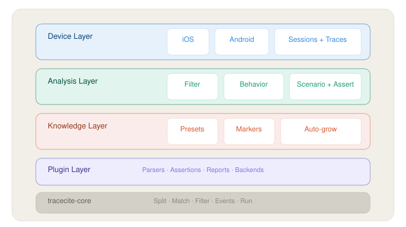

<p align="center">
  <strong>TraceCite Mobile</strong>
</p>

<p align="center">
  <strong>让 Agent 直接分析手机上的日志 — 基于 TraceCite Core 构建。</strong>
</p>

<p align="center">
  <a href="#"></a>
  <a href="#"></a>
  <a href="#"></a>
  <a href="#"></a>
</p>

---

## 解决什么痛点

排查手机 App 问题时，四个反复出现的问题：

**日志是事后的。** 问题发生在手机上，但你只能在事后从 IDE 导出日志——故障时刻的上下文已经丢失。

**日志和行为是两套语言。** 日志写的是 `"[1234]: [UI] button tapped: checkout"`，但你要回答的是「用户在崩溃前做了什么操作」。

**卡顿需要不止一种数据。** App 卡死了，光看日志看不出是主线程阻塞还是内存压力。需要性能采样，但手动操作 xctrace 或 Perfetto 很繁琐。

**每次从头开始。** 同一个 App，类似的问题，每次都要重新想用什么关键词、看什么指标。没有积累。

## 安装

```bash
# 先装 tracecite-core：https://github.com/xxx/tracecite-core
git clone https://github.com/xxx/tracecite-core
pip install -e ./tracecite-core

# 再装 Mobile
pip install -e .
tracecite-mobile profile init
```

iOS 需要 `idevicesyslog`（libimobiledevice）和 Xcode 命令行工具。Android 需要 `adb`（SDK Platform Tools）。

## 怎么用

```bash
# 1. 启动后台采集
tracecite-mobile session start --date

# ... 在设备上复现问题 ...

# 2. 分析事发前后 2 分钟的日志（先 seal 切段，再 filter）
tracecite-mobile seal --from-sessions --json
tracecite-mobile filter --from-sessions --last 2m --preset system-fault --json

# 3. 把日志行提升为用户行为事件
tracecite-mobile behavior summarize --from-sessions --json
```

实时日志默认保留最近 30 分钟作为 hot 窗口；采集器每 30 分钟执行一次归档检查，
把已过期的数据移入隐藏的内部 `.archive/`。日常只需使用 `archive list` 和
 `archive pull`，不需要、也不建议直接管理该目录。

维护清理是显式操作：`clean analysis --before today` 只清理过期日志、性能产物
和未 pinned 的已完成分析运行；运行状态、锁、仍在采集/恢复中的产物以及损坏的
manifest 会 fail-closed 保留。分析 run 默认清理 `~/Documents/TraceCite/mobile/*/runs/`（及 profile 指定的 `analysis_output_dir`）；日志/性能目录下的 `.runs` 容器也会逐个 run 判断。归档证据默认不碰；先用
`clean analysis --include-archive --dry-run` 预览，实际删除必须同时指定
`--include-archive --yes`。

一次完整的排查跑下来，Agent 拿到：

- **时间窗内的结构化命中** — 哪一行、什么时间、匹配了什么关键词
- **用户行为事件流** — 「用户打开了设置页 → 点击了保存 → App 卡死」
- **完整的运行记录** — 输入被冻结、参数被记录，随时可复现

```bash
# 卡顿问题？同步录制性能采样
tracecite-mobile capture start --template "Time Profiler"
# ... 复现卡顿 ...
tracecite-mobile capture stop    # → 自动输出 trace 文件 + 卡顿摘要

# 忘了搜什么？用预设词表
tracecite-mobile filter app.log --preset system-lifecycle --json
tracecite-mobile filter app.log --preset network-http --json
tracecite-mobile filter app.log --preset memory-leak --json

# 保留通用 preset，同时补充本次事故关键词（按 OR 合并）
tracecite-mobile filter app.log --preset network-http --grep 'checkout|payment' --json
```

## 相比直接丢日志给 AI

| | 丢日志给 AI | TraceCite Mobile |
|---|---|---|
| 采集方式 | 事后从 IDE 手动导出 | 后台实时采集，故障时刻不丢失 |
| 数据种类 | 只有文本日志 | 日志 + 性能采样，一条命令录制 |
| 分析输出 | 原始文本，AI 自己解析 | 结构化 JSON + 用户行为事件 |
| 用户行为 | AI 从日志字符串推断 | 自动提升为结构化行为事件 |
| 知识积累 | 无 | 本地知识库，越用越有效 |
| 可复现 | 两次分析中间步骤不同 | 运行清单记录所有参数，冻结输入 |

## 整体架构

Core 提供了文本分析的引擎。Mobile 在此基础上加了四层：



`--platform ios|android` 通过同一能力契约切换平台。可用
`performance profiles` 查询当前平台的性能 profile；未声明的可选能力会明确失败，
不会静默降级。

```bash
tracecite-mobile --platform ios performance profiles --json
tracecite-mobile --platform android performance start --profile frame --json
```

## 自定义流程

**预设词表。** 不用每次手写正则。常见场景有预设好的关键词集合：

```bash
tracecite-mobile filter app.log --preset system-lifecycle --json
tracecite-mobile filter app.log --preset network-http --grep 'checkout|payment' --json
tracecite-mobile preset add --name my-preset --terms "支付失败, 网络超时, 订单异常"
```

**场景文件。** 把排查流程写成 JSON，团队共享、版本控制：

```json
{
  "name": "crash-investigation",
  "source": { "type": "session", "device": "ios" },
  "filter": {
    "stages": [
      { "grep": "SIGABRT|SIGSEGV", "scope": { "last": "2m" } },
      { "grep": "backtrace|callstack" }
    ]
  },
  "assert": {
    "rules": [
      { "type": "contains", "match": "SIGABRT", "min": 1 }
    ]
  }
}
```

```bash
tracecite-mobile scenario run crash-investigation.json
```

**知识积累。** 查过的问题、发现过的特征，自动沉淀到本地知识库：

```bash
tracecite-mobile grow auto app.log --preset my-app   # 自动从日志发现高频特征
tracecite-mobile grow audit --preset my-app           # 清理不再有用的词
```

所有知识存在 `.tracecite/` 本地目录，不联网。

## 相关包

- [**tracecite-core**](../tracecite-core/) — 底层的文本分析引擎。

## 许可证

MIT
